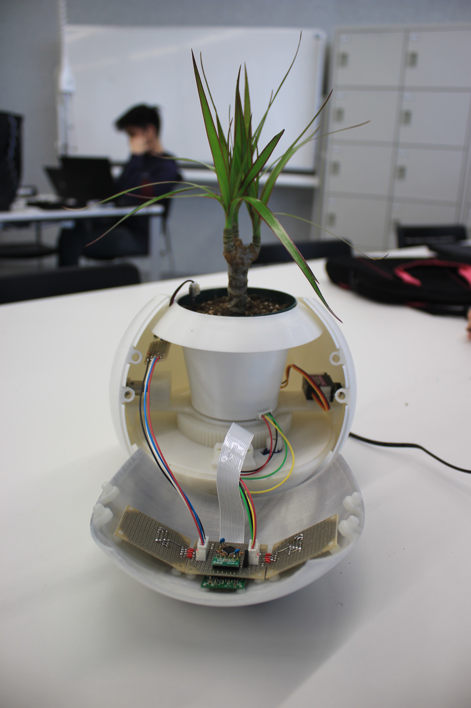

# Smart Plant IoT Project
A client user interface to monitor smartplant.

## The device overview
<div>
    
    
</div>

The sensor to watch the plant health is controlled by atmega chip and raspberrypi as its core. The data then passed to the firebase cloud. By doing so, the client will fetch the data provided by the cloud by utilizing its api created using google functions.

## Client
Multi platform smartphone used was the idea of this project. By so, the client is created using expo react native.

### Tree
All the **source code** is stored inside the [./src](./src/) directory.
```
└── src
    └── App.js
```

### Usage
Go to the [./src](./src/) directory then run:
```
npx expo start
```
Use the QR code shown to open the application.


## Video
https://youtube.com/watch?v=NsKa_3FIpPk&feature=share

## License
[MIT](./LICENSE)